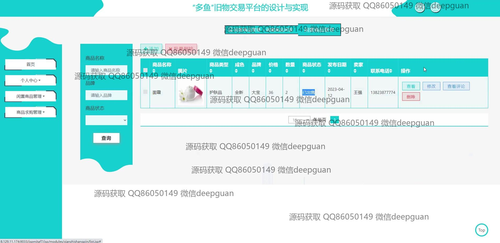

<h1 align="center">“多鱼”旧物交易平台的设计与实现</h1>

## 简介
“多鱼”旧物交易平台：角色分为管理员和用户；支持商品浏览与搜索、信息发布与管理、在线交流和支付系统；具有留言板、多项管理功能及高效的二手商品交易管理体验。    --计算机毕业设计源码；毕设源码；java毕业设计源码

## 联系方式

<h3 align="center">获取完整代码与数据库文件 + 微信：deepguan QQ: 86050149 QQ群: 783742310</h3>

<h3 align="center">可帮忙远程部署 包运行成功！提供远程部署、修改代码、设计文档指导、代码讲解等服务！</h3>

## 功能介绍（完整见运行截图）
管理员：主要功能包括用户管理、商品类型管理、闲置商品管理、商品求购管理、留言板管理和系统管理。可以查看、修改、删除用户信息以及商品详情，帮助用户编辑、提交和取消商品和用户信息。

用户：可以在平台上注册、登录和浏览商品，并通过导航栏快速访问各个功能模块。用户能够查看商品详情、上传或编辑商品信息，与其他用户进行留言互动及查看和评论商品。用户个人中心允许查看和修改个人信息，管理订单、地址和收藏。

## 运行截图

本代码来源于网络,仅供学习参考使用!

